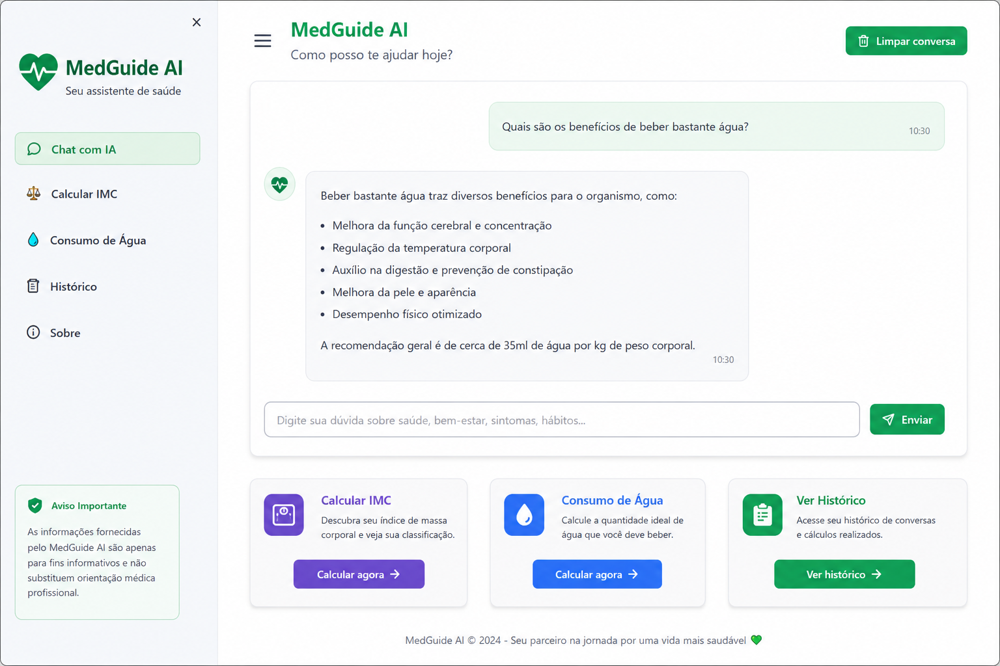

# 🩺 MedGuide AI

Assistente Virtual Inteligente de Saúde e Bem-Estar utilizando Inteligência Artificial Generativa.

<p align="center">  </p> <p align="center">     </p>
---

# 📌 Sobre o Projeto

O MedGuide AI é uma aplicação desenvolvida em Python com Streamlit e OpenAI para simular um assistente virtual inteligente capaz de responder perguntas relacionadas à saúde e bem-estar utilizando linguagem natural.

O projeto foi desenvolvido para atender ao desafio da DIO aplicando:

- IA Generativa
- Python
- UX
- Persistência de dados
- Estrutura modular
- Engenharia de Prompt

---

# 🚀 Funcionalidades

## 🤖 Chat Inteligente

- Respostas contextualizadas
- Linguagem natural
- Explicações educativas
- Integração com OpenAI

## ⚖️ Cálculo de IMC

- Cálculo automático
- Classificação do IMC

## 💧 Consumo Diário de Água

- Recomendação baseada no peso corporal

## 📜 Histórico

- Histórico salvo em JSON

---

# 🛠️ Tecnologias

- Python
- Streamlit
- OpenAI API
- JSON
- Python-dotenv

---

# 📂 Estrutura do Projeto

```bash
medguide-ai/
│
├── app.py
├── requirements.txt
├── .env.example
├── README.md
│
├── data/
│   └── historico.json
│
├── services/
│   ├── ai_service.py
│   ├── health_service.py
│   └── memory_service.py
│
├── utils/
│   └── formatter.py
│
└── assets/
```

---

# ▶️ Como Executar

## Instalar dependências

```bash
pip install -r requirements.txt
```

## Configurar API

Criar arquivo:

```env
.env
```

Adicionar:

```env
OPENAI_API_KEY=sua_chave
```

## Executar

```bash
streamlit run app.py
```

---

# ✅ Verificação Completa

## Front-end

O projeto utiliza Streamlit como interface gráfica.

Toda a interface é construída diretamente no `app.py`, portanto não existem arquivos HTML/CSS separados.

## Back-end

Todos os serviços necessários estão implementados:

- ai_service.py
- health_service.py
- memory_service.py
- formatter.py

## Fluxos validados

- Chat IA ✅
- IMC ✅
- Consumo de água ✅
- Histórico JSON ✅
- Persistência ✅
- Integração OpenAI ✅

---

# 🏁 Conclusão

O MedGuide AI demonstra a aplicação prática de IA Generativa utilizando Python, arquitetura modular e UX moderna em uma solução funcional e escalável.
